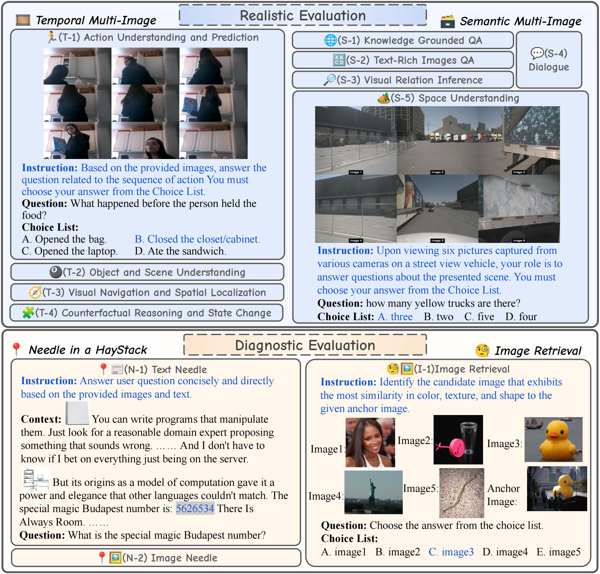

<!--
**MileBench/MileBench** is a ✨ _special_ ✨ repository because its `README.md` (this file) appears on your GitHub profile.

Here are some ideas to get you started:

- 🔭 I’m currently working on ...
- 🌱 I’m currently learning ...
- 👯 I’m looking to collaborate on ...
- 🤔 I’m looking for help with ...
- 💬 Ask me about ...
- 📫 How to reach me: ...
- 😄 Pronouns: ...
- ⚡ Fun fact: ...
-->


# MileBench 🛣️

[**🌐 Homepage**](https://milebench.github.io/) | [**🤗 Dataset**](https://huggingface.co/datasets/FreedomIntelligence/MileBench/) | [**🤗 Paper**](https://milebench.github.io/) | [**📖 arXiv**](https://milebench.github.io/) | [**GitHub**](https://github.com/MileBench/MileBench)

This repo contains evaluation code for the paper "MileBench: Benchmarking MLLMs in Long Context".

<center>

   
</center>

## 🌈 Update

* **[2024.4.15]** 🎉🎉🎉 MileBench is public!🎉🎉🎉


## Contents
- [Introduction](#introduction)
- [Dataset Preparation](#🤗-dataset-preparation)
- [How to Evaluate](#ℹ️-how-to-evaluate)
- [License](#license)
- [Contact](#contact)
- [Citation](#citation)


## Introduction

We introduce **MileBench**, a pioneering benchmark designed to rigorously test the **M**ult**I**modal **L**ong-cont**E**xt capabilities of MLLMs. This benchmark comprises a mix of text and images, long contexts, multiple tasks, and tasks requiring both comprehension and generation. To systematically assess the capabilities of MLLM in multimodal long contexts, our benchmark consists of two distinct evaluation sets, **diagnostic evaluation** and **realistic evaluation**. The former explores the long-context recall abilities of MLLMs, using needle-in-a-haystack and image retrieval tasks, while the latter stress-tests the model in a manner akin to real-world conditions using both temporal multi-image tasks and semantic multi-image tasks.

After evaluating 20 models, the closed-source Gemini 1.5 excelled in the realistic evaluation, achieving an impressive score of 54.7%, though it still falls short of a perfect 100% score. Meanwhile, GPT-4(Vision) managed to reach a peak score of 99.4% in the diagnostic evaluation. On the contrary, most open-source multimodal models struggled with long-context tasks. Only VILA and Qwen-VL-7B managed average scores of 44.4% and 37.2% in realistic and diagnostic evaluations respectively. These results underscore that there are *"miles to go"* towards fully-realized long-context MLLMs, prompting a call for increased research focus on such tasks, especially those involving numerous images.




## Preparation

### 🤗 Dataset Preparation

The MileBench dataset comprises 6,440 samples from 29 datasets, with each sample containing multiple images. 
The data has been archived on HuggingFace and can be downloaded from [this link](https://huggingface.co/datasets/FreedomIntelligence/MileBench/).
Save the dataset under data folder.

### 🤖 Environment Setup

Install required packages:
```bash
pip install -r requirements.txt
```

## ℹ️ How to Evaluate

### Modify model configuration file

<details><summary>Click to expand</summary>

In `configs/model_configs.yaml`:

```yaml
# Add a new model "my_model"
my_model:
    model_name: "my_model"
    model_dir: "path/to/full/model" # HuggingFace model weights
    cfg_path: "path/to/full/model_config"   # can be none
    gen_kwargs:
        max_new_tokens: 512
        min_new_tokens: 1
        do_sample: false
```
</details>

### Modify model worker

<details><summary>Click to expand</summary>

In `workers/model_workers.py`:
1. add a new model class

```python
class MyModel(BaseWorker):

    def init_components(self, config) -> None:
        # init the model components

    def forward(self, questions: list[str], image_paths: list[list], device, gen_kwargs) -> list[str]:
        # Prepare images and text for generate function

```

2. for github packages of different VLM models, we recommand you to save them to `./packages` directory. Then you don't need to install pip packages in your env.
</details>


### Modify utils.py

<details><summary>Click to expand</summary>

In `utils.py`:
import your model

```python
from workers.model_workers import MyModel   # modify here

name2worker = {
    "my_model": MyModel,  # modify here
    }
```
</details>

### Generate response

<details><summary>Click to expand</summary>
Set GPU num in `/configs/accelerate_configs.yaml`:

```yaml
num_processes: GPU_NUM    # modify here
```

Modify `eval.sh`:

```bash

gpu_num=GPU_NUM  # modify here

for model in my_model; do  # modify here
    for dataset_name in dataset_name; do  # modify here
...
```

and run:

```bash
source eval.sh
```

</details>


### Run evaluation

<details><summary>Click to expand</summary>

run:
```bash
python score.py \
    --result-dir outputs \
    --models my_model  # models to eval
# Result saved to outputs/result.csv
```

</details>

## License
[](https://github.com/MileBench/MileBench/blob/main/LICENSE)
[](https://github.com/MileBench/MileBench/blob/main/DATA_LICENSE)

All software is licensed under the Apache License, Version 2.0 (Apache 2.0).
All other materials are licensed under the Creative Commons Attribution 4.0 International License (CC-BY).

## Declaration
The dataset we're using is an aggregation of publicly accessible datasets licensed under the Creative Commons license (CC-BY) or other open-source licenses. We've meticulously adhered to all required legal procedures to incorporate this data into our research, recognizing the importance of transparency in data licensing for proper attribution and suitable data utilization. 
Our dataset also encompasses images derived from publicly accessible datasets and language data created through the GPT-4V api. While measures have been put in place to secure suitable content, we acknowledge the potential existence of problematic content. Should you come across any such content, we urge you to inform us immediately so we can make the necessary adjustments to sustain a dataset free from inappropriate content. We are unwavering in our commitment to maintain a high-quality, ethically responsible dataset and promise to uphold principles of privacy and transparency throughout our work.


## Contact

- Dingjie Song: bbsngg@outlook.com
- Benyou Wang: wangbenyou@cuhk.edu.cn

## Citation

If you find this repository helpful, please consider citing it:
```


```

